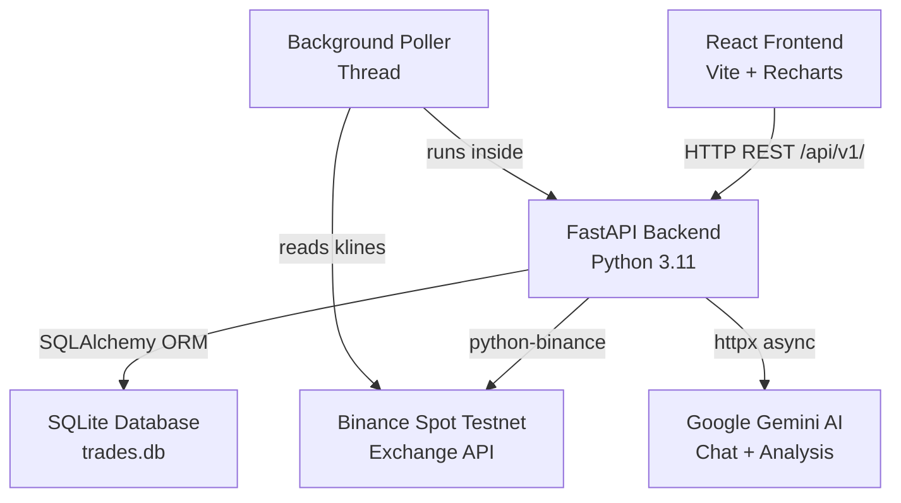
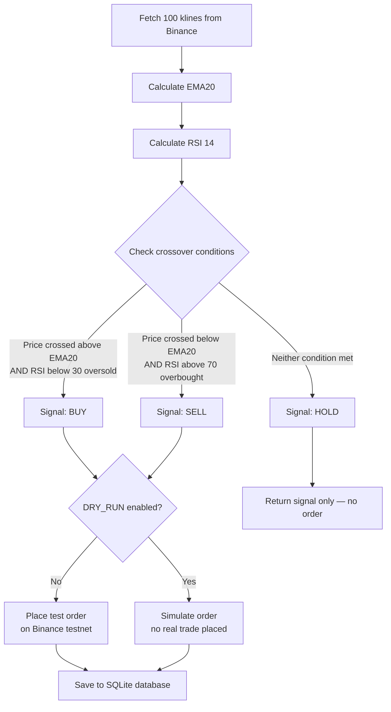
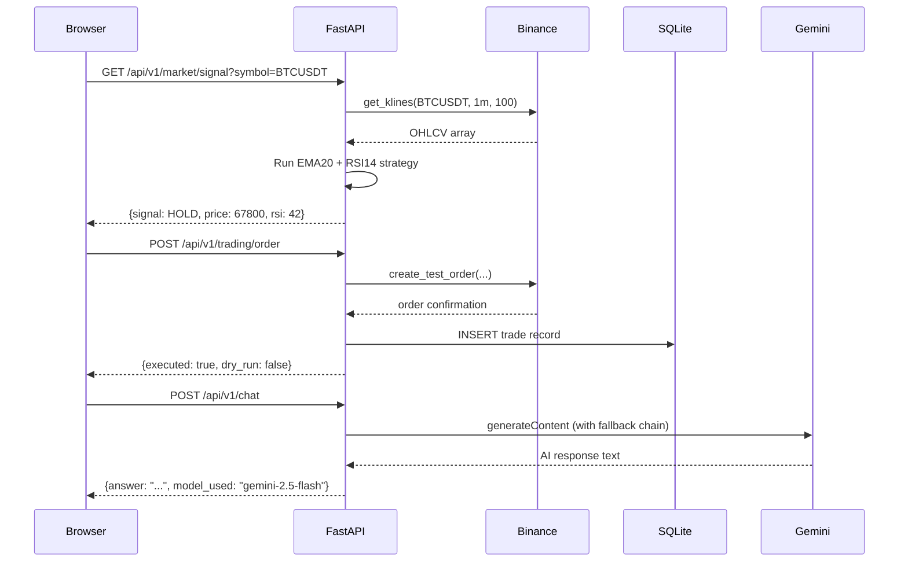
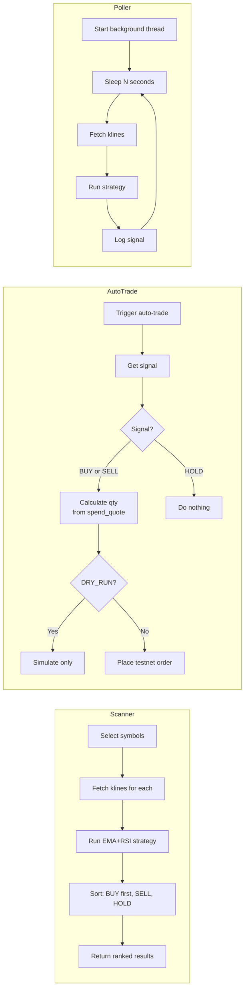
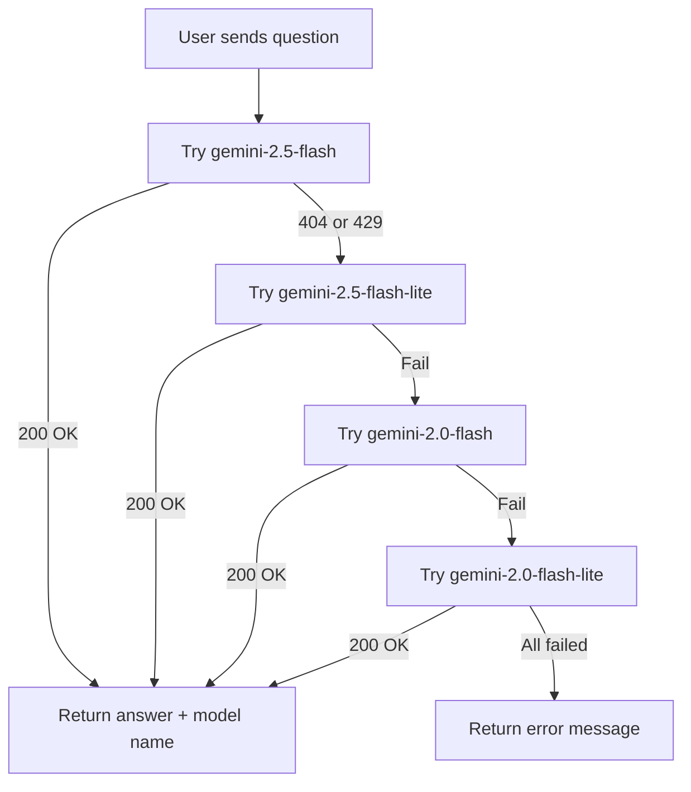

# CTP·BOT — Crypto Trade Professional

A full-stack crypto trading system built with **FastAPI** (Python) and **React**. It connects to the **Binance Spot Testnet** so you can test real trading strategies with live market data but zero real money. It also has an **AI assistant** powered by Google Gemini that explains signals and gives market analysis.

I built this to understand how real trading systems work — from fetching live prices, running technical indicators, placing test orders, all the way to a proper dashboard UI.

---

## What it does

- Fetches live OHLCV candlestick data from Binance testnet
- Runs an **EMA20 + RSI(14)** strategy to generate BUY / SELL / HOLD signals
- Places test orders on Binance testnet (no real money involved)
- Stores all trades in a local SQLite database
- Background poller that checks signals automatically every N seconds
- Multi-symbol scanner — scan 20 coins at once for signals
- Risk/Reward calculator — stop-loss, take-profit, position sizing
- AI assistant (Google Gemini) with automatic model fallback chain
- Full dark-themed React dashboard with live price charts

---

## System Architecture



---

## Trading Strategy Flow



---

## API Request Flow



---

## Automation Flow



---

## AI Fallback Chain



---

## Project Structure

```
crypto-trading-system/
├── backend/
│   ├── api/
│   │   ├── market.py        # GET klines, ticker, orderbook, signal
│   │   ├── trading.py       # POST order, run-now, trade history
│   │   ├── account.py       # GET balances, open orders, cancel
│   │   ├── poller.py        # POST start/stop, GET status
│   │   ├── automation.py    # Scanner, auto-trade, AI analysis, risk calc
│   │   ├── chat.py          # Gemini AI with 5-model fallback
│   │   └── deps.py          # Admin token auth dependency
│   ├── services/
│   │   ├── exchange_client.py   # Binance wrapper with retry logic
│   │   ├── strategy_service.py  # EMA + RSI signal logic
│   │   ├── trader_service.py    # Order placement + DB save
│   │   └── poller.py            # Background thread
│   ├── models/
│   │   └── db.py            # SQLAlchemy Trade model + session
│   ├── config.py            # Pydantic settings from .env
│   ├── schemas.py           # Request/response models
│   ├── logging_config.py    # Loguru setup
│   └── main.py              # FastAPI app, middleware, routers
├── ui/
│   ├── src/
│   │   ├── components/
│   │   │   ├── Dashboard.jsx    # Watchlist, live chart, balances
│   │   │   ├── Trading.jsx      # Order form, orderbook, history
│   │   │   ├── Automation.jsx   # Scanner, auto-trade, AI, risk calc
│   │   │   ├── Assistant.jsx    # Gemini chat with markdown
│   │   │   ├── Markdown.jsx     # Markdown renderer
│   │   │   └── Toast.jsx        # Notification toasts
│   │   ├── styles/global.css    # Dark theme + custom scrollbar
│   │   ├── api.js               # All API calls in one place
│   │   └── App.jsx              # Root app, sidebar, topbar
│   ├── .env.example
│   └── package.json
├── data/                    # SQLite database (gitignored)
├── logs/                    # Log files (gitignored)
├── .env                     # Your secrets (gitignored)
├── .env.example             # Template — safe to commit
├── requirements.txt
├── Procfile                 # Heroku / Railway
├── render.yaml              # Render deployment
└── railway.toml             # Railway deployment
```

---

## API Endpoints

All under `/api/v1/`. Visit `/docs` for interactive Swagger UI.

| Method | Endpoint | Auth | Description |
|--------|----------|------|-------------|
| GET | `/health` | — | Health check — exchange, DB, poller |
| GET | `/api/v1/market/klines` | — | OHLCV candlestick data |
| GET | `/api/v1/market/ticker` | — | Latest price |
| GET | `/api/v1/market/orderbook` | — | Bids and asks |
| GET | `/api/v1/market/signal` | — | EMA+RSI strategy signal |
| GET | `/api/v1/market/exchange-info` | — | Symbol trading rules |
| POST | `/api/v1/trading/order` | ✓ | Place a test order |
| POST | `/api/v1/trading/run-now` | ✓ | Run strategy + optionally trade |
| GET | `/api/v1/trading/history` | ✓ | Paginated trade history from DB |
| GET | `/api/v1/account` | ✓ | Account balances |
| GET | `/api/v1/account/orders/open` | ✓ | Open orders |
| DELETE | `/api/v1/account/orders/{symbol}/{id}` | ✓ | Cancel order |
| GET | `/api/v1/poller/status` | — | Poller running status |
| POST | `/api/v1/poller/start` | ✓ | Start background poller |
| POST | `/api/v1/poller/stop` | ✓ | Stop background poller |
| POST | `/api/v1/automation/scan` | ✓ | Scan multiple symbols |
| POST | `/api/v1/automation/auto-trade` | ✓ | Auto-trade on signal |
| POST | `/api/v1/automation/ai-analysis` | ✓ | AI market analysis |
| POST | `/api/v1/automation/risk-check` | — | Risk/reward calculator |
| GET | `/api/v1/automation/summary` | ✓ | Overview of top signals |
| POST | `/api/v1/chat` | — | Chat with Gemini AI |
| GET | `/api/v1/chat/models` | — | List available Gemini models |

✓ = requires `X-Admin-Token` header

---

## Setup

### 1. Clone

```bash
git clone https://github.com/chandu1234678/crypto-trading-system.git
cd crypto-trading-system
```

### 2. Backend

```bash
# Create virtual environment
py -m venv .venv
.venv\Scripts\activate        # Windows
# source .venv/bin/activate   # Mac/Linux

# Install dependencies
pip install -r requirements.txt

# Create your .env from the template
cp .env.example .env
# Edit .env — add your Binance testnet keys and Gemini API key
```

### 3. Frontend

```bash
cd ui
cp .env.example .env.local
# Edit .env.local if needed (defaults work for local dev)
npm install
```

### 4. Run

```bash
# Terminal 1 — backend
.venv\Scripts\activate
uvicorn backend.main:app --host 127.0.0.1 --port 8000 --reload

# Terminal 2 — frontend
cd ui
npm run dev
```

Open `http://localhost:5173` — API docs at `http://localhost:8000/docs`

---

## Environment Variables

| Variable | Default | Description |
|----------|---------|-------------|
| `API_KEY` | — | Binance testnet API key |
| `API_SECRET` | — | Binance testnet API secret |
| `API_BASE_URL` | `https://testnet.binance.vision` | Exchange URL |
| `ADMIN_TOKEN` | `admin123` | Token for protected endpoints |
| `GEMINI_API_KEY` | — | Google Gemini API key |
| `GEMINI_MODEL` | `gemini-2.5-flash` | Primary AI model |
| `DRY_RUN` | `True` | Simulate orders without placing |
| `USE_TEST_ORDER` | `True` | Use Binance test order endpoint |
| `SYMBOL` | `BTCUSDT` | Default symbol for poller |
| `POLL_INTERVAL` | `30` | Seconds between poller checks |
| `SPEND_QUOTE` | `10.0` | USDT per auto-trade |
| `RSI_OVERSOLD` | `30.0` | RSI threshold for BUY |
| `RSI_OVERBOUGHT` | `70.0` | RSI threshold for SELL |
| `EMA_SPAN` | `20` | EMA period |
| `RSI_WINDOW` | `14` | RSI period |
| `DATABASE_URL` | `sqlite:///./data/trades.db` | DB connection |
| `ALLOWED_ORIGINS` | localhost URLs | Comma-separated CORS origins |
| `LOG_LEVEL` | `INFO` | Logging level |
| `ENV` | `development` | Set to `production` for prod checks |

---

## Deployment

### Render

1. Fork this repo
2. Go to [render.com](https://render.com) → New Web Service
3. Connect your GitHub repo — `render.yaml` handles the rest
4. Set environment variables in the Render dashboard

### Railway

1. Connect repo to [railway.app](https://railway.app)
2. `railway.toml` handles build and start command
3. Add env vars in Railway dashboard

### Heroku

```bash
heroku create your-app-name
heroku config:set API_KEY=xxx API_SECRET=xxx GEMINI_API_KEY=xxx ADMIN_TOKEN=xxx
git push heroku master
```

---

## Notes

- Uses **Binance Spot Testnet** — no real money involved at all
- `DRY_RUN=True` by default — orders are simulated even on testnet
- AI uses a 5-model fallback chain so it keeps working if one model is rate-limited
- The EMA+RSI strategy is intentionally simple — this is a learning project
- Never commit your `.env` file — it is gitignored

---

## Tech Stack

**Backend** — Python 3.11, FastAPI, SQLAlchemy, python-binance, pandas, ta, httpx, loguru, slowapi, pydantic v1

**Frontend** — React 18, Vite, Recharts, marked

---

## License

MIT
